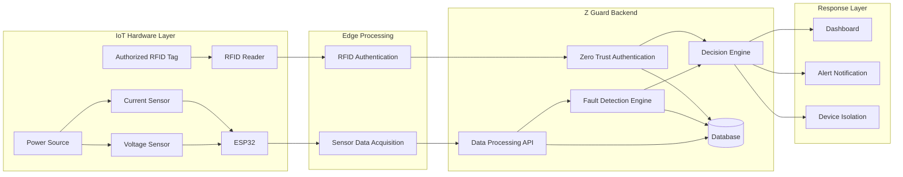
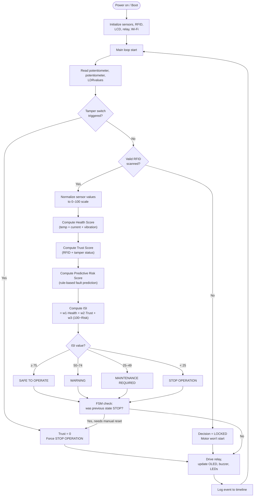

# ZGuard

### Zero Trust Industrial Guardian for Intelligent Machine Safety

An intelligent Industrial IoT platform that combines real-time machine health monitoring, Zero Trust cybersecurity, and autonomous decision-making through the Guardian Decision Engine.

---

<p align="center">
  
  
  
  
  <br/>
  
  
  
  
</p>

---

## Team

- **Team Name:** FIVEFOLD
- **Members:** K G V Kiruthika sri, M V Vijay aditiya, Bhavadharani R, Thanishkar, Padmavathi

### Roles:
- **System Orchestrator:** K G V Kiruthika sri
- **Trust Engine Architect:** M V Vijay aditiya
- **Cyber Defense Architect:** Bhavadharani R
- **Guardian Intelligence Architect:** Thanishkar
- **Digital Twin & Visual Storyteller (Dashboard and UI Engineer):** Padmavathi

- **Hackathon:** 
- **Duration:** 24 Hours
- **Domain:** Industrial IoT • Cybersecurity • Embedded Systems • Smart Manufacturing

---

## System Architecture



## Detailed Workflow

This is the exact decision sequence the ESP32 runs on every loop cycle — from raw sensor read to physical action.



### Step-by-step

1. **Boot** — ESP32 initializes all sensors, the RFID reader, OLED, and relay to a known safe state.
2. **Sensor read** — current, temperature, and vibration are sampled every cycle.
3. **Tamper check** — this overrides everything else; a triggered enclosure switch forces STOP regardless of sensor health.
4. **RFID check** — an invalid or missing card locks the motor out before any score is even computed.
5. **Scoring** — Health, Trust, and Risk scores are calculated independently, then fused into the ISI.
6. **Decision mapping** — the ISI is mapped to one of four states.
7. **State memory (FSM)** — the system won't silently leave STOP just because the ISI recovers; it requires an explicit reset.
8. **Action** — the relay, LCD, buzzer, and LEDs are updated to reflect the final decision.
9. **Logging** — every decision is appended to the event timeline for the dashboard.
10. Loop repeats continuously.

---

# 🛠 Tech Stack

## Hardware
- ESP32 Dev Module
- RFID-RC522 Reader
- Voltage Sensor
- Current Sensor
- Buzzer
- Relay Module
- LED
- Breadboard & Jumper Wires

## Software
- Arduino IDE
- Python (FastAPI)
- HTML, CSS, JavaScript
- Git & GitHub

## Database
- SQLite / PostgreSQL 

## Communication
- Wi-Fi
- HTTP REST API
- JSON

---

## ESP32 Firmware

1. Open the `firmware` folder in Arduino IDE.
2. Select **ESP32 Dev Module**.
3. Update Wi-Fi credentials.
4. Upload the firmware to ESP32.

---

# ▶️ Usage

1. Power the ESP32.
2. Scan an authorized RFID card.
3. ESP32 starts collecting voltage and current data.
4. Sensor data is transmitted to the backend.
5. Fault detection analyzes electrical parameters.
6. Dashboard displays device status.
7. If a fault is detected, an alert is generated and the device can be isolated.

---

# 🗄 Database

## Tables

### Devices
- Device ID
- RFID UID
- Status

### Sensor Data
- Timestamp
- Voltage
- Current
- Device ID

### Alerts
- Alert ID
- Fault Type
- Severity
- Timestamp

---

# 🤖 Fault Detection Workflow

```text
RFID Authentication
        │
        ▼
ESP32 Activated
        │
        ▼
Read Voltage & Current
        │
        ▼
Transmit Sensor Data
        │
        ▼
Backend Processing
        │
        ▼
Fault Detection
        │
        ▼
Normal? ─────► Dashboard Updated
        │
       No
        ▼
Alert Generated
        │
        ▼
Device Isolation (if required)
```

---

# ⚠️ Challenges Faced

- Integrating hardware components (ESP32, RFID, voltage and current sensors).
- Ensuring reliable real-time sensor data transmission.
- Reducing false fault detections caused by sensor noise.
- Synchronizing RFID authentication with live device monitoring.
- Maintaining low latency between hardware and backend.
- Managing secure communication between IoT devices and the server.

---

# 🚀 Future Scope

- Integrate AI/ML models for predictive fault detection and anomaly analysis.
- Support multiple IoT devices with centralized monitoring.
- Implement MQTT for scalable real-time communication.
- Add cloud deployment for remote monitoring and management.
- Introduce role-based access control and advanced Zero Trust policies.
- Send instant alerts via SMS, Email, or mobile notifications.
- Develop a dedicated Android/iOS application.
- Generate automated maintenance reports and analytics dashboards.

---

# 🔒 Security Measures

- RFID-based device authentication to allow only authorized access.
- Secure communication between ESP32 and backend using REST APIs.
- Input validation and sanitization for all incoming sensor data.
- Fault detection using real-time voltage and current monitoring.
- Zero Trust approach where every device request is verified before processing.
- API keys and sensitive credentials are stored using environment variables (`.env`) and are never hardcoded.
- Access logs are maintained for monitoring authentication and system events.

---

# 🤖 AI Integration

This project uses the **Google Gemini API** for AI-powered analysis and assistance.

## AI Features
- Fault analysis and interpretation.
- Intelligent insights from sensor data.
- Assistance in identifying abnormal device behavior.
- Context-aware recommendations based on detected faults.
